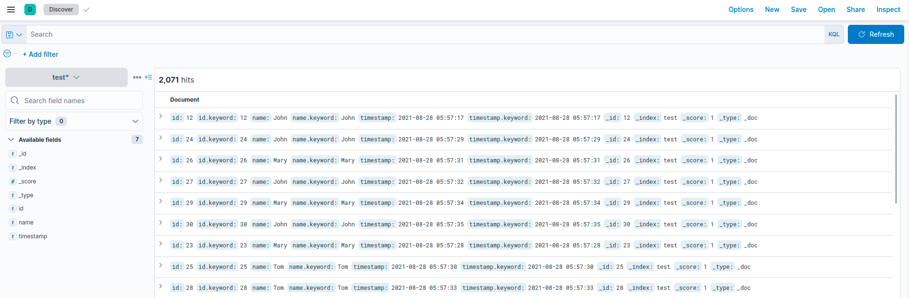
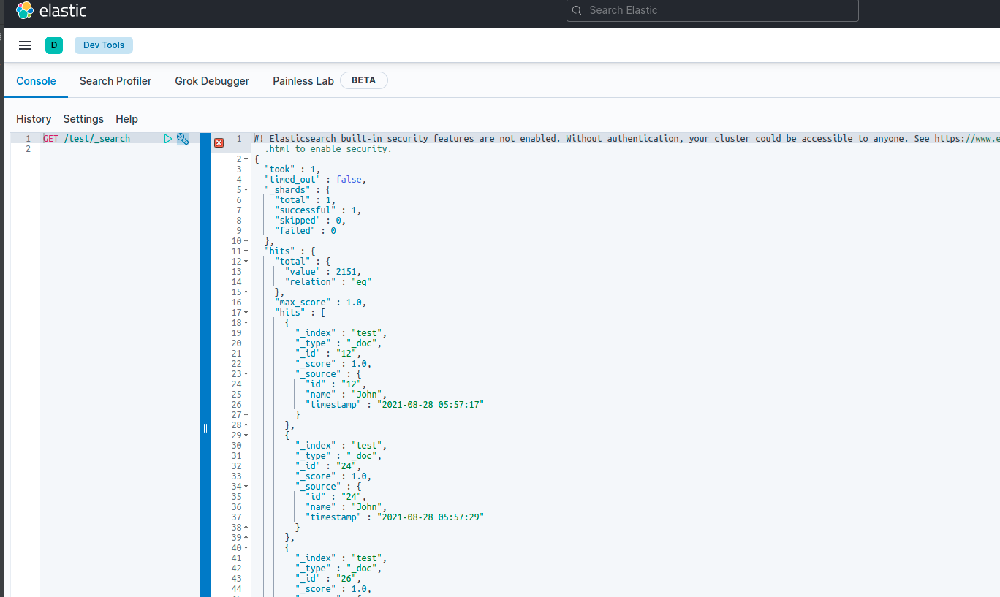
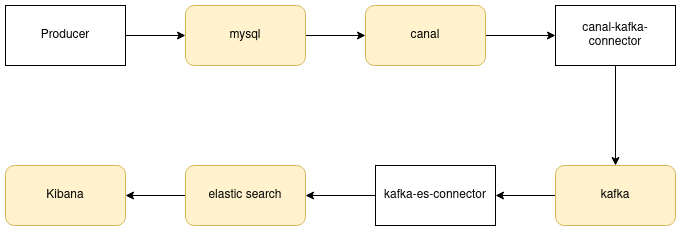

# canal-es

prerequisite:
- docker

how to test:
- `make dev-up` in your terminal
- open kibana `localhost:5601` in your browser

in Kibana, there's two ways to find data
- create index pattern `test`
- go to discoveryS
  

or

- go to `Dev Tools`
- GET /test/_search

## Concept

### Producer
Generating user login data to mysql

https://github.com/go-sql-driver/mysql

### mysql
database: `test` \
table: `login` 

[init sql script](./mysql/init/init-db.sql)
### canal
subscribe to mysql and fetch binlog

https://github.com/alibaba/canal 
### canal-kafka-connector
- kafkacat is installed
- https://github.com/withlin/canal-go 
- https://github.com/segmentio/kafka-go

this component can be replaced by canal MQ feature \
https://github.com/alibaba/canal/wiki/Canal-Kafka-RocketMQ-QuickStart

### kafka

### kafka-es-connector
- kafkacat is installed
- https://github.com/segmentio/kafka-go
- https://github.com/elastic/go-elasticsearch

this component can be replaced by kafka connector \
https://github.com/confluentinc/kafka-connect-elasticsearch
### elastic search

### kibana

